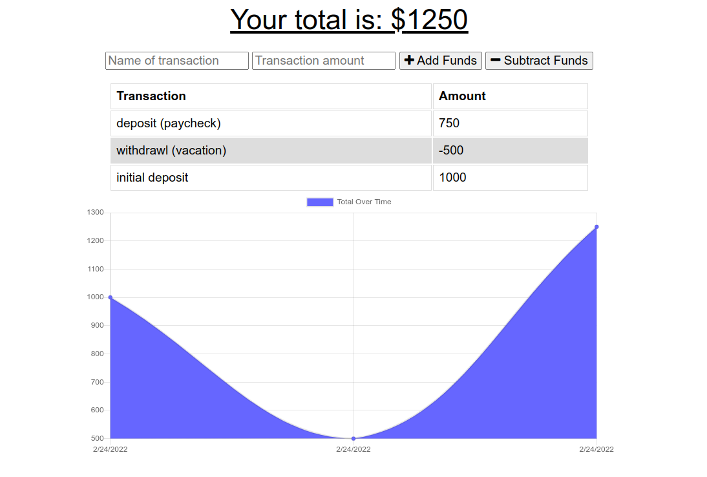

# budget-tracker

Manage budget allocations, and expenditures.

## Description

A fully operational PWA for managing a budget.

## Table Of Contents

- [budget-tracker](#budget-tracker)
  - [Description](#description)
  - [Table Of Contents](#table-of-contents)
  - [Local Installation (only if executing on local server/pc)](#local-installation-only-if-executing-on-local-serverpc)
  - [Usage for deployed Installation](#usage-for-deployed-installation)
  - [Usage for local Installation](#usage-for-local-installation)
  - [Questions](#questions)

## Local Installation (only if executing on local server/pc)

To install locally, clone this repository to your local environment. This is a node application, so node must be installed. mongoDB must also be installed locally. For mongoDB documentation and installation instructions see https://docs.mongodb.com/manual/introduction/. If you need to install node, check out this link https://nodejs.org/en/download/. Once mongoDB and node (and npm) are installed, attach to the repository root directory and update npm dependencies with the following command:

* npm install compression express mongoose morgan  
  

## Usage for deployed Installation

To execute the application using the Heroku deployed application, click the following link:

https://budget-tracker-msdale.herokuapp.com
  
The application interface should appear as "Your total is: $xxxx" in your browser.

## Usage for local Installation

To execute the application locally, connect to the root diretory in the cloned repository and type:

**npm start** 
  
or type

**npm run start**
  
The application interface will be available in your browser as:

http://localhost:3001

From here, if you are using the Chrome browser, you can use Devtools to "throttle" the network, and/or startup the service-worker to monitor the use of Caching and indexedDB usage.  
  
The application must remain running in the terminal until your done with it, at which time you can terminate it with a CTRL-C keystroke.

## Questions

Any questions, please contact Mark Dale.

My email address is: msdaledad@gmail.com
My github profile is https://github.com/msdale
